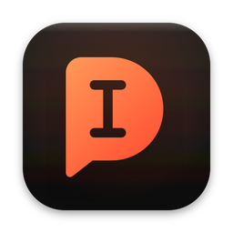
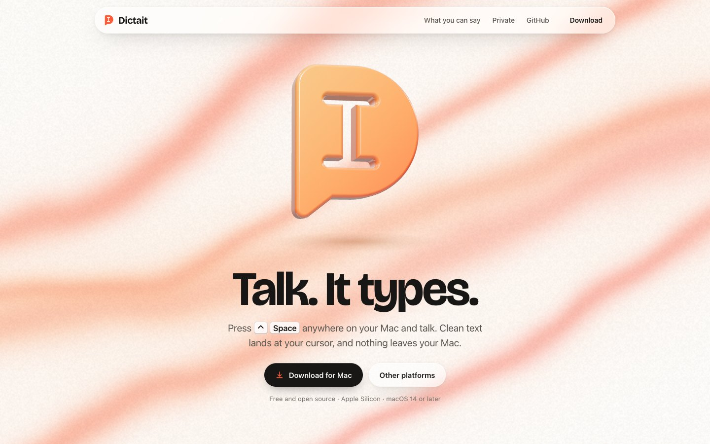
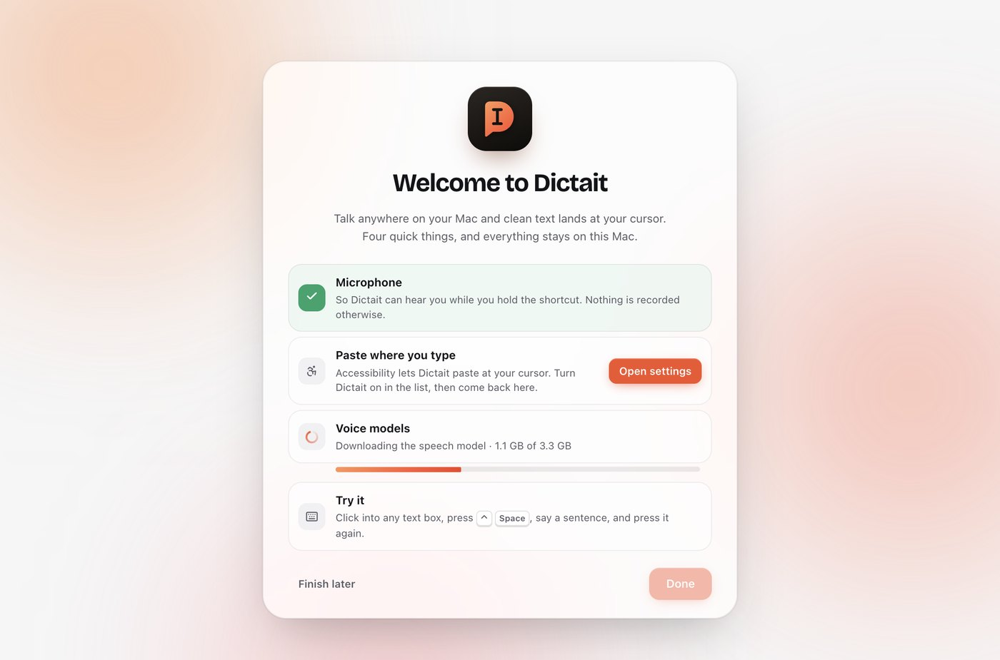
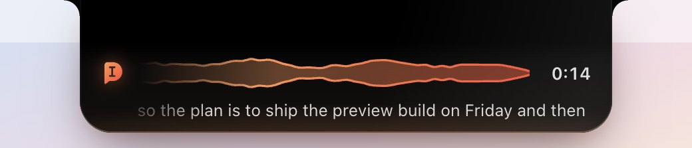
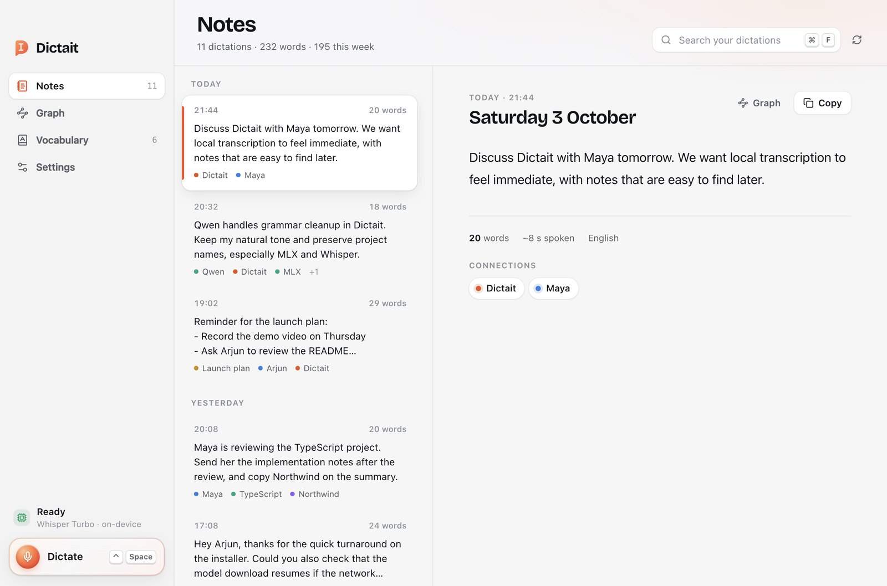

<p align="center">
  
</p>

<h1 align="center">Dictait</h1>

<p align="center">
  <b>Talk. It types.</b> Private dictation for your Mac.<br>
  Press <kbd>⌃</kbd> <kbd>Space</kbd> anywhere, talk, and clean text lands at your cursor.<br>
  Speech recognition and cleanup run entirely on your Mac. No account, no cloud, no subscription.
</p>

<p align="center">
  <a href="https://github.com/soorajsatheesan/Dictait/releases/latest"></a>
  
  <a href="LICENSE"></a>
</p>

<p align="center">
  
</p>

---

## Install

| Platform | Download | Or |
|---|---|---|
| **macOS** (Apple Silicon, macOS 14+) | [Dictait for Mac (.dmg)](https://github.com/soorajsatheesan/Dictait/releases/latest) | the one-line installer below |
| **Linux** (Debian, Ubuntu, Mint) | [Dictait for Linux (.tar.gz)](https://github.com/soorajsatheesan/Dictait/releases/latest) | [Linux version](#linux-version) |
| **Source** | [Source code (.zip)](https://github.com/soorajsatheesan/Dictait/archive/refs/heads/main.zip) | `git clone` and [SETUP.md](SETUP.md) |
| **Windows** | Not yet: the speech engine runs on Apple Silicon | |

Every release is built and published by GitHub Actions, with a `SHA256SUMS.txt` beside the files.

**Apple Silicon Mac (M1 or later), macOS 14 Sonoma or later.**

### One line, no prompts

```bash
curl -fsSL https://raw.githubusercontent.com/soorajsatheesan/Dictait/main/install.sh | sh
```

It downloads the latest release from GitHub, checks it against the published SHA-256, installs it in Applications and opens it. Files fetched this way are not quarantined, so macOS opens Dictait without asking.

### Or download the disk image

1. Download **Dictait-x.y.z-mac-arm64.dmg** from the [latest release](https://github.com/soorajsatheesan/Dictait/releases/latest) and drag Dictait into Applications.
2. Open Dictait. macOS says it can’t verify the developer, because Dictait isn’t notarized by Apple yet. Click **Done**.
3. Open **System Settings → Privacy & Security** and click **Open Anyway**. You only do this once; Dictait then clears the flag from the rest of its bundle itself.

### First launch: the setup stage

Dictait opens with a short checklist, and each line ticks itself off:

| Step | What happens |
|---|---|
| **Microphone** | Allow it once. Dictait only listens while you hold or toggle the shortcut. |
| **Paste where you type** | Turn Dictait on under Accessibility so it can paste at your cursor. Without it, your words wait on the clipboard for ⌘V. |
| **Voice models** | Downloads Whisper Large v3 Turbo and a small Qwen model (about 3 GB, once), with live progress. After this, Dictait works offline. |
| **Try it** | Click into any text box, press ⌃ Space, say a sentence, press it again. |

<p align="center"></p>

### Updates

Dictait checks GitHub for new releases now and then (**Settings → Updates**; you can switch it off). When one is out, **Update now** downloads it, verifies the checksum, swaps the app in place and reopens it. Your notes, vocabulary, settings, models and macOS permissions are kept.

---

## What it does

<p align="center"></p>

- **Dictate anywhere.** Tap ⌃ Space to start and again to finish, or hold it while you talk and let go. The island drops from the notch, shows your voice and your words as you speak, then pastes clean, punctuated text at the cursor. If no text box has focus, the text is copied instead.
- **Talk the way you talk.** “Scratch that” removes the sentence you just said. “New line” and “new paragraph” break the text. Self-corrections like “at five, no, at six” keep only what you meant.
- **Say what you want.** End or start a dictation with “as bullet points”, “number these”, “summarize this”, “format this as an email”, “make this shorter” or “more formal”.
- **Edit by voice.** Select text in any app, press ⌃ Space and say what to change. Dictait rewrites the selection in place.
- **Fits where you’re typing.** Reads the sentence before your cursor (never saved, never in password fields) so names and flow match, and adapts tone: casual in chat, polished in email, literal in code.
- **Learns your words.** Add names and terms in Vocabulary, or correct one once and Dictait offers to remember it.
- **Long dictations.** Up to 30 minutes. Dictait transcribes in pieces at your natural pauses while you keep talking, so stopping only waits for the last few seconds.
- **Paste it again.** ⌃ ⌥ V pastes your last dictation; the menu bar keeps the last ten.
- **Your notes, kept.** Every dictation becomes a searchable note, linked by the people, projects and terms in it. Browse them in **Notes** and **Graph**, or open the folder as an Obsidian vault.

<p align="center"></p>

### Models

| Role | Model | Notes |
|---|---|---|
| Speech (default) | [Whisper Large v3 Turbo, MLX](https://huggingface.co/mlx-community/whisper-large-v3-turbo) | English, Hindi and broad multilingual coverage |
| Speech (optional) | [Parakeet TDT 0.6B v3, MLX](https://huggingface.co/mlx-community/parakeet-tdt-0.6b-v3) | Quick English and European languages; no Hindi |
| Cleanup | [Qwen3.5 2B, 4-bit MLX](https://huggingface.co/mlx-community/Qwen3.5-2B-4bit) | Grammar, punctuation, fillers, spoken instructions |

Models load once and stay warm in one worker process. On an M-series Mac a short sentence transcribes in under half a second and is cleaned up in well under a second.

### Privacy

- Audio and text are processed on your Mac. Recordings are deleted as soon as they are transcribed, or when cancelled.
- Nothing listens while idle. There is no account and no telemetry.
- The only network use is downloading the models once, and the update check against GitHub (which you can turn off).
- Notes, vocabulary and settings live in `~/Library/Application Support/Dictait/`. Logs never contain what you said.

---

## Build from source

Needs Python 3.11 to 3.13 and Node 20 or later. Or hand [SETUP.md](SETUP.md) to your coding agent.

```bash
git clone https://github.com/soorajsatheesan/Dictait.git
cd Dictait && ./install-macos.sh
```

The installer creates a private Python runtime, downloads the models, builds the app, signs it locally and installs it in `~/Applications`. Re-run it to update.

```bash
./build-macos.sh                         # build dist/Dictait.app without installing
cd desktop && npm install && npm run dev # work on the interface with live reload
dist/Dictait.app/Contents/MacOS/Dictait --preview setup setup.png light      # render a screen
dist/Dictait.app/Contents/MacOS/Dictait --preview hud:recording island.png   # render the island
"$HOME/Library/Application Support/Dictait/runtime/bin/python" -m unittest discover -s macos/tests
```

### Project layout

```text
desktop/                   Electron app: TypeScript, React, Motion
  src/main/                Menu bar, shortcut, worker pipes, settings, paste, updater
  src/main/updater.ts      Updates from GitHub Releases
  src/renderer/src/views/  Setup, Notes, Graph, Vocabulary, Settings
  src/renderer/src/hud/    The island and microphone capture
  native/helper.swift      Shortcut press and release, text near the cursor, ⌘V, microphones, notch
  resources/brand/         The mark and app icon sources
macos/backend/             The local MLX worker (speech, cleanup, memory); JSON over pipes, no ports
macos/tests/               Worker and memory tests
release.sh                 Build the disk image and Linux bundle; publish a GitHub Release
install.sh                 Install the latest release (the one-line installer)
install-macos.sh           Build and install from source
```

### Releasing (maintainers)

1. Bump `version` in `desktop/package.json`.
2. Commit and push to `main`.

The **Release** workflow builds the self-contained disk image and the Linux bundle on an Apple Silicon runner and publishes `vX.Y.Z` with `SHA256SUMS.txt`. Installed copies offer the update from **Settings → Updates**, the website’s download buttons and the one-line installer pick it up automatically. To build a release by hand instead: `./release.sh --publish soorajsatheesan/Dictait`.

The app is signed locally (ad hoc) with a stable identity, so macOS keeps its permissions across updates. With an Apple Developer ID, set `DICTAIT_SIGN_IDENTITY` and `DICTAIT_NOTARY_PROFILE` and `release.sh` signs, notarizes and staples, which removes the first-launch prompt.

---

## Linux version

A lighter, separate tool for Debian, Ubuntu and Mint on Wayland or X11: press **Super+I** to start listening and again to stop. Whisper runs on your computer and the text is copied for **Ctrl+V**.

```bash
sudo apt install python3-venv portaudio19-dev wl-clipboard   # or xclip on X11
python3 -m venv venv && ./venv/bin/pip install -r requirements.txt
./enable-autostart.sh
```

The first dictation downloads the Whisper model once. `register-shortcut.sh` binds Super+I; `run_super_i.sh` runs it by hand.

---

## Contributing

Issues and pull requests are welcome. See [CONTRIBUTING.md](CONTRIBUTING.md).

## License

[MIT](LICENSE). Whisper, Parakeet and Qwen are distributed under their own licenses by their authors.
